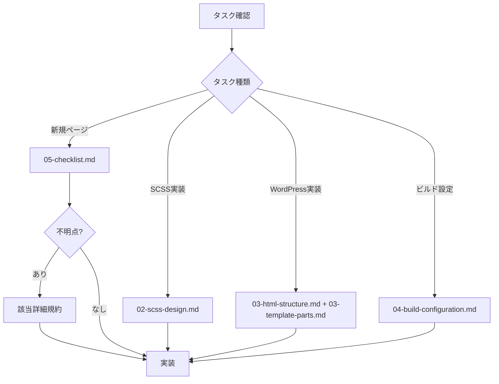
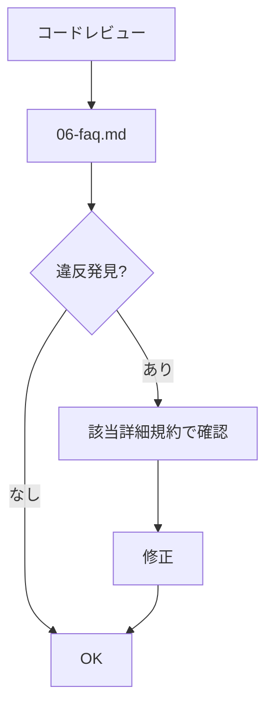

# コーディング規約 Just-in-Time ローダー

このプロンプトは、タスクに応じて必要な規約のみを読み込むためのガイドです。

## 📋 タスク別読み込みフロー

### 1. プロジェクト初見・全体把握

**読み込むファイル:**
```
docs/coding-guidelines/01-project-structure.md
```

**用途:**
- プロジェクト構造の理解
- 技術スタック確認
- 実装済みページ一覧確認
- ディレクトリ構成の把握

---

### 2. SCSS実装タスク

**読み込むファイル:**
```
docs/coding-guidelines/02-scss-design.md
```

**用途:**
- FLOCSS + BEM命名規則
- レスポンシブ設計（rv/svw関数）
- コンテナ幅設定
- ベーススタイル継承ルール

**重要ポイント:**
- ケバブケース必須（キャメルケース禁止）
- `&-`ネスト記法絶対禁止
- デフォルトPC、`@include sp`でオーバーライド
- ベーススタイル重複禁止

---

### 3. WordPress実装タスク

**読み込むファイル:**
```
docs/coding-guidelines/03-html-structure.md        # HTML構造・セマンティック
docs/coding-guidelines/03-template-parts.md        # テンプレートパーツ設計
docs/coding-guidelines/03-image-handling.md        # 画像出力規約
docs/coding-guidelines/03-sanitization.md          # サニタイズ規約
```

**用途:**
- ページテンプレート構造
- template-parts使用方法
- **画像出力規約（render_responsive_image必須）**
- template-parts切り分けルール

**重要ポイント:**
- Template Nameコメント必須
- 画像は`render_responsive_image()`使用
- PageHeaderコンポーネント活用
- ACFフィールド存在チェック

---

### 4. ビルド設定タスク

**読み込むファイル:**
```
docs/coding-guidelines/04-build-configuration.md
```

**用途:**
- vite.config.jsエントリーポイント追加
- enqueue.php設定
- 本番ビルド確認

**重要ポイント:**
- vite.config.js更新忘れ注意（致命的）
- 404ページは開発/本番でスラッグ異なる
- カスタム投稿タイプは手動マッピング必要

---

### 5. 新規ページ作成タスク

**ステップ1: チェックリスト読み込み**
```
docs/coding-guidelines/05-checklist.md
```

**ステップ2: 必要に応じて詳細規約を読み込み**
- SCSS実装 → `02-scss-design.md`
- WordPress実装 → `03-html-structure.md` + `03-template-parts.md`
- ビルド設定 → `04-build-configuration.md`

**フロー:**
1. チェックリストで全体把握
2. 不明点があれば該当する詳細規約を参照
3. 完了後、チェックリストで最終確認

---

### 6. コードレビュー・修正タスク

**読み込むファイル:**
```
docs/coding-guidelines/06-faq.md
```

**用途:**
- よくある規約違反パターン確認
- アンチパターン回避
- FAQ参照

**その後、必要に応じて:**
- 該当する詳細規約（02, 03, 04）を参照

---

## 🤖 エージェント別推奨フロー

### wordpress-professional-engineer

**基本セット:**
```
1. docs/coding-guidelines/03-html-structure.md + 03-template-parts.md（必須）
2. docs/coding-guidelines/02-scss-design.md（SCSS実装時）
3. docs/coding-guidelines/04-build-configuration.md（vite.config.js更新時）
```

**タスク別:**
- 新規ページ作成 → `05-checklist.md` → 詳細規約
- 画像実装 → `03-image-handling.md`
- レビュー → `06-faq.md` → 該当規約

---

### production-reviewer

**基本セット:**
```
1. docs/coding-guidelines/06-faq.md（アンチパターン確認）
2. docs/coding-guidelines/05-checklist.md（最終チェック項目）
```

**レビュー観点別:**
- SCSS規約 → `02-scss-design.md`
- WordPress規約 → `03-html-structure.md` + `03-template-parts.md` + `03-sanitization.md`
- ビルド設定 → `04-build-configuration.md`

---

### flocss-base-specialist

**基本セット:**
```
1. docs/coding-guidelines/02-scss-design.md（必須）
2. .serena/memories/base-styles-reference.md（重複チェック用）
```

**確認ポイント:**
- ベーススタイル重複
- FLOCSS設計原則
- BEM命名規則

---

### interactive-ux-engineer

**基本セット:**
```
1. docs/coding-guidelines/02-scss-design.md（BEM命名のみ）
```

**確認ポイント:**
- アニメーション用クラス名はBEM準拠
- `data-*`属性の活用

---

## 📝 コマンド別推奨フロー

### /figma-implement

**ステップ別読み込み:**

1. **初期フェーズ**: なし（Figma解析のみ）
2. **WordPress実装**: `03-html-structure.md` + `03-template-parts.md`
3. **SCSS実装**: `02-scss-design.md`
4. **ビルド設定**: `04-build-configuration.md`
5. **最終レビュー**: `06-faq.md` + `05-checklist.md`

---

## 🎯 効率的な読み込みパターン

### パターン1: 最小限読み込み（推奨）

```
タスク確認 → 該当する1ファイルのみ読み込み → 実装
```

**例:** 画像出力実装
```
docs/coding-guidelines/03-image-handling.md
```

---

### パターン2: 段階的読み込み

```
チェックリスト → 不明点発生 → 詳細規約参照
```

**例:** 新規ページ作成
```
1. 05-checklist.md で全体把握
2. SCSS不明点 → 02-scss-design.md 参照
3. WordPress不明点 → 03-html-structure.md / 03-template-parts.md 参照
```

---

### パターン3: レビュー時読み込み

```
FAQ → アンチパターン確認 → 該当規約で詳細確認
```

**例:** コードレビュー
```
1. 06-faq.md でアンチパターン確認
2. 違反発見 → 該当する詳細規約（02/03/04）で正しい実装確認
```

---

## ⚠️ 非効率なパターン（避けるべき）

### ❌ 全ファイル一括読み込み

```
# これは非効率
01-project-structure.md
02-scss-design.md
03-html-structure.md
03-template-parts.md
03-image-handling.md
03-sanitization.md
04-build-configuration.md
05-checklist.md
06-faq.md
```

→ トークン消費が大きすぎる

---

### ❌ 旧CODING_GUIDELINES.md読み込み

```
# 非推奨ファイルは読まない
CODING_GUIDELINES.md  # ❌ 使用禁止
```

→ `docs/coding-guidelines/`配下を使用

---

## 📊 トークン効率比較

| 読み込みパターン | トークン数（概算） | 効率 |
|----------------|------------------|------|
| 旧CODING_GUIDELINES.md全体 | ~60,000 | ❌ 非効率 |
| 全ファイル読み込み | ~40,000 | ⚠️ 非効率 |
| チェックリスト + 詳細1ファイル | ~15,000 | ✅ 効率的 |
| 詳細1ファイルのみ | ~8,000 | ✅✅ 最効率 |
| FAQ + 詳細1ファイル | ~12,000 | ✅ 効率的 |

---

## 🚀 推奨ワークフロー

### 新規実装時



### レビュー時



---

## 💡 Tips

1. **セクション単位で読み込み**: ファイル全体ではなく、必要なセクションのみ参照
2. **並列読み込み活用**: 複数エージェント使用時は、各エージェントで異なるファイル読み込み
3. **FAQ優先**: 問題発生時はまず`06-faq.md`で既知の問題か確認
4. **Serenaメモリ活用**: ベーススタイル確認は`.serena/memories/base-styles-reference.md`

---

このフローに従うことで、トークン消費を最小限に抑えながら、必要な規約情報に効率的にアクセスできます。
